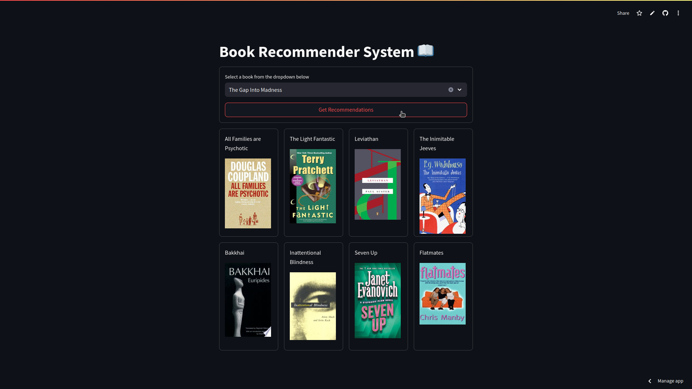

# Book Recommender Web App using Content Based Filtering

This web app recommends books based on user input. It uses streamlit and is deployed on streamlit community cloud.

Kaggle Notebook: <https://www.kaggle.com/code/bhaskarbordoloi/book-recommendation-system?scriptVersionId=214481829>

Dataset Link: <https://www.kaggle.com/datasets/abdallahwagih/books-dataset>

## Snapshot



## Approach

The idea is to build a recommender system using content-based filtering technique. This recommendation technique utilizes the item features to generate recommendations based on content similarity.

The system combines 'authors', 'categories' and 'description' features and uses cosine similarity to compute similarities between the books.

Word2Vec embedding technique is used to generate word embeddings and thus calculate simlarity between items.

## Prerequisites

* Python 3.10 or above
* Streamlit
* A web browser for accessing the UI.

## Installation Guide

1. Clone the repository

    ```bash
        git clone https://github.com/bhaskrr/book-recommender-system.git
        cd book-recommender-system
    ```

2. Install Dependencies

    ```bash
        pip install -r requirements.txt
    ```

3. Run the app

    ```bash
        streamlit run app.py
    ```

    A window will open in your default browser with the app. Otherwise, open your browser and visit <http://localhost:8501/>.

## Usage

1. Open the app in the browser
2. Select a book from the dropdown
3. Click on the Get Recommendations button
4. View the generated recommendations

## Known Issues and Limitations

1. Limited novelty and diversity.
2. Heavy reliance on feature engineering.
